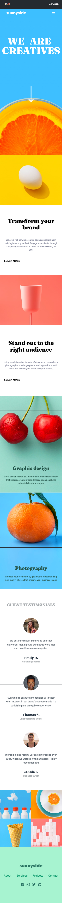
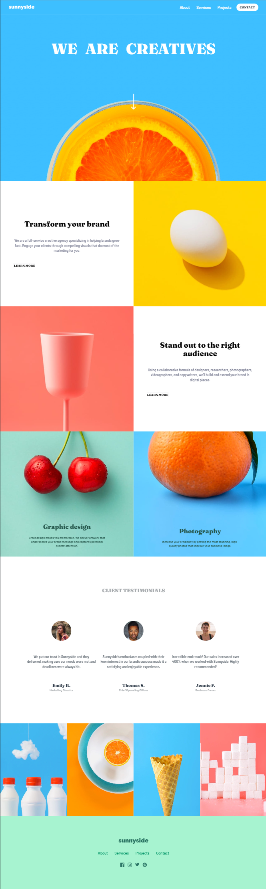

# Sunnyside Project

This project contains the Sunnyside landingpage project.

## Overview

### Screenshot

### Links

- Live Site URL: [Here](https://raphaelelias-sunnyside.vercel.app)

## My Process

### Built With

- HTML
- Tailwind CSS

### What I Learned

During this project, I reinforced my understanding of:

- Using Tailwind CSS for styling
- Basic HTML structure

### Useful Resources

- [Tailwind CSS Documentation](https://tailwindcss.com/docs) - Helpful for understanding Tailwind CSS classes and features.

## Author

- Linkedin - [Linkedin](https://www.linkedin.com/in/raphaeleliass)
- GitHub - [Github](https://www.github.com/raphaeleliass)
- My Projects - [Portfolio](https://raphaelelias.vercel.app)

## Acknowledgments

- Coded by [Raphael Elias](https://www.github.com/raphaeleliass).
